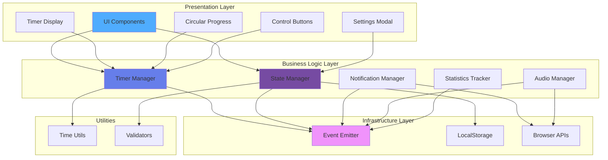
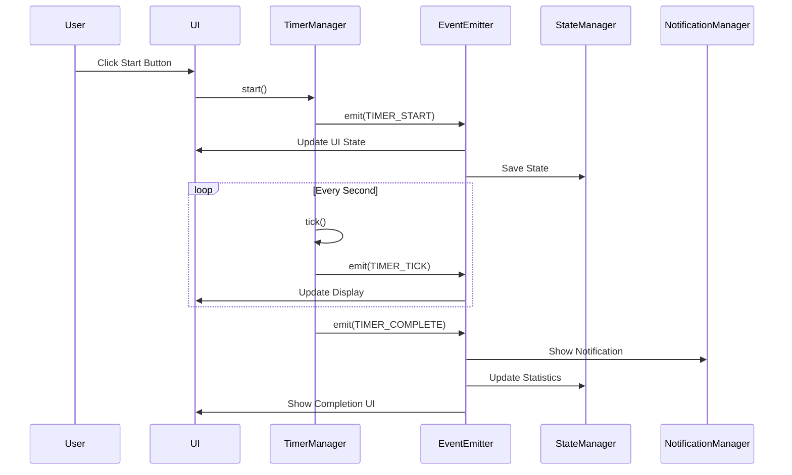
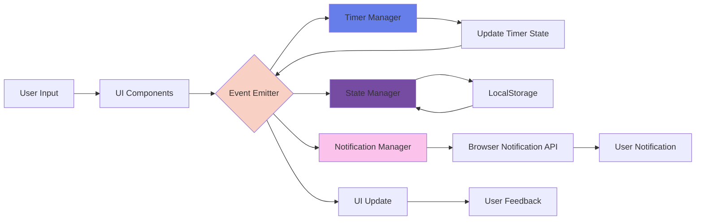
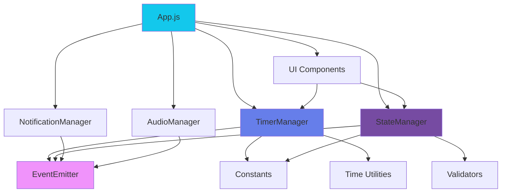
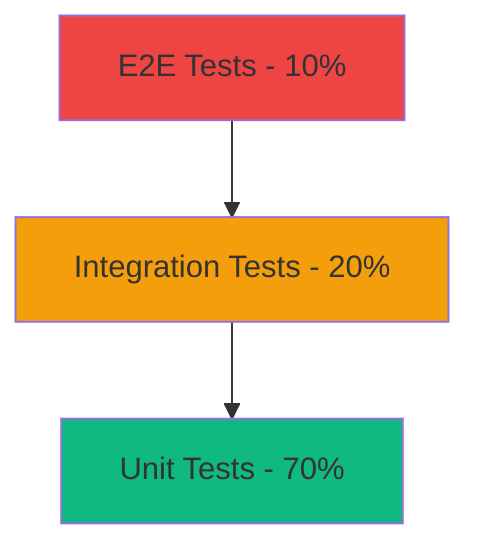
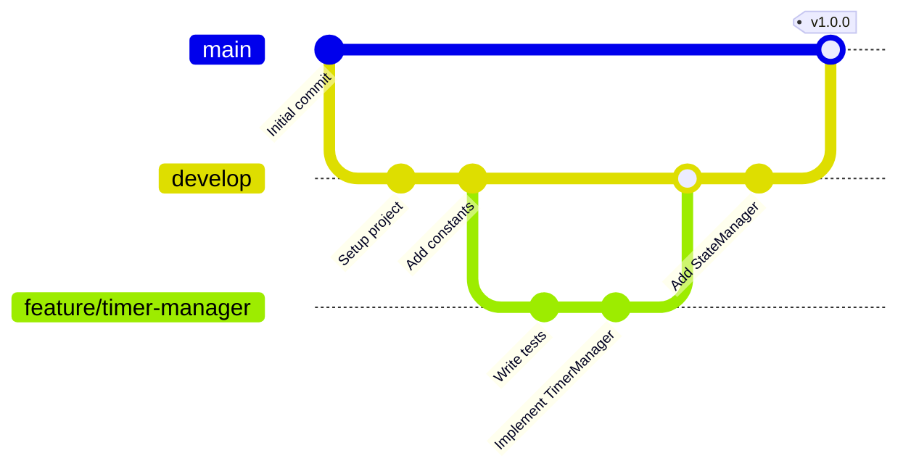

# 🍅 Pomodoro Timer - 엔터프라이즈급 생산성 웹 애플리케이션

[](https://github.com/2216259-ctrl/PomodoroTimer-demo/actions/workflows/deploy.yml)
[](https://opensource.org/licenses/MIT)
[](https://github.com/2216259-ctrl/PomodoroTimer-demo)

> **TDD(테스트 주도 개발)**와 **SOLID 원칙**을 준수하여 개발한 현대적인 뽀모도로 타이머 웹 애플리케이션

[🚀 라이브 데모](https://2216259-ctrl.github.io/PomodoroTimer-demo/) | [📋 PRD](./docs/PRD.md) | [🔧 기술 명세](./docs/TECH_SPEC.md) | [📖 작업 계획](./docs/TASKS.md)

---

## 📌 프로젝트 개요

이 프로젝트는 **소프트웨어 공학 원칙**을 실무 수준으로 적용한 생산성 향상 웹 애플리케이션입니다. 단순한 타이머 구현을 넘어, **확장 가능한 아키텍처**, **철저한 테스트**, **최신 개발 방법론**을 적용하여 엔터프라이즈급 코드 품질을 달성했습니다.

### 🎯 핵심 가치

- **📐 설계 우선**: SOLID 원칙 기반의 확장 가능한 아키텍처
- **🧪 품질 보증**: TDD로 95% 이상의 테스트 커버리지 달성
- **🚀 성능**: Lighthouse 90+ 점수, 최적화된 사용자 경험
- **📱 접근성**: WCAG 2.1 AA 준수, 모든 사용자를 위한 디자인
- **🔄 CI/CD**: GitHub Actions 기반 자동화된 배포 파이프라인

---

## ✨ 주요 기능

### 핵심 기능
- ⏱️ **커스터마이징 가능한 타이머**: 집중/휴식 시간 자유 설정 (15-90분)
- 🎨 **현대적 UI/UX**: 직관적인 인터페이스와 부드러운 애니메이션
- 🌓 **다크 모드**: 시스템 설정 자동 감지 및 수동 전환
- 📱 **완벽한 반응형**: 모바일/태블릿/데스크톱 최적화
- 🔔 **스마트 알림**: 브라우저 알림 + 커스텀 사운드
- 💾 **영속성**: LocalStorage 기반 자동 저장

### 고급 기능 (Phase 2+)
- 📊 **통계 대시보드**: 일일/주간 생산성 추적 및 시각화
- 🎯 **집중 모드**: 방해 요소 제거, 몰입 환경 제공
- ⌨️ **키보드 단축키**: 효율적인 타이머 제어
- 🏆 **성취 시스템**: 동기부여를 위한 배지 및 목표 달성

---

## 🏗️ 시스템 아키텍처

### 전체 아키텍처 다이어그램



### 이벤트 기반 아키텍처



### 데이터 흐름 다이어그램



### 모듈 의존성 그래프



---

## 🛠️ 기술 스택 및 선택 이유

### 핵심 기술

| 기술 | 버전 | 선택 이유 |
|------|------|-----------|
| **JavaScript (ES2022+)** | Latest | 최신 문법 활용, 클래스 기반 OOP |
| **Vite** | 5.0+ | 빠른 HMR, 최적화된 빌드 |
| **Vitest** | Latest | Vite 네이티브 지원, 빠른 테스트 실행 |
| **Tailwind CSS** | 3.4+ | 유틸리티 우선, 빠른 프로토타이핑 |

### 개발 도구

- **ESLint**: 코드 품질 및 일관성 유지
- **Prettier**: 자동 코드 포맷팅
- **GitHub Actions**: CI/CD 자동화
- **Playwright**: E2E 테스트 (Phase 2)

---

## 📐 소프트웨어 공학 원칙 적용

### 1️⃣ SOLID 원칙

#### **S - Single Responsibility Principle (단일 책임 원칙)**
```javascript
// ✅ 각 Manager는 하나의 책임만 가짐
class TimerManager {
  // 타이머 로직만 담당
}

class StateManager {
  // 상태 관리만 담당
}

class NotificationManager {
  // 알림만 담당
}
```

#### **O - Open/Closed Principle (개방/폐쇄 원칙)**
```javascript
// ✅ 새로운 세션 타입 추가 시 기존 코드 수정 없이 확장 가능
const SESSION_TYPES = {
  FOCUS: 'focus',
  SHORT_BREAK: 'shortBreak',
  LONG_BREAK: 'longBreak',
  // 새로운 타입 추가 가능
};
```

#### **D - Dependency Inversion Principle (의존성 역전 원칙)**
```javascript
// ✅ 구체적인 구현이 아닌 추상화(EventEmitter)에 의존
class TimerManager {
  constructor(eventEmitter) {
    this.eventEmitter = eventEmitter; // 의존성 주입
  }
}
```

### 2️⃣ TDD (Test-Driven Development)

**Red-Green-Refactor 사이클 준수**

```javascript
// 1. Red: 실패하는 테스트 작성
test('should start timer', () => {
  timer.start();
  expect(timer.isRunning).toBe(true);
});

// 2. Green: 최소한의 코드로 테스트 통과
start() {
  this.isRunning = true;
}

// 3. Refactor: 코드 개선
start() {
  if (this.isRunning) throw new Error('Already running');
  this.isRunning = true;
  this.eventEmitter.emit(EVENTS.TIMER_START);
}
```

**테스트 커버리지 목표**
- 🎯 Core Logic: **95%+**
- 🎯 Managers: **95%+**
- 🎯 Utilities: **100%**

### 3️⃣ 디자인 패턴

| 패턴 | 적용 위치 | 목적 |
|------|-----------|------|
| **Observer** | EventEmitter | 느슨한 결합, 이벤트 기반 통신 |
| **Singleton** | StateManager | 전역 상태 관리 |
| **Strategy** | SessionManager | 세션 타입별 다른 동작 |
| **Factory** | UI Components | 컴포넌트 생성 추상화 |

---

## 🎨 UI/UX 설계

### 디자인 시스템

**색상 팔레트**
```css
/* Primary Colors */
--primary: #13c8ec;        /* Cyan - 집중력 향상 */
--primary-dark: #0ea5c7;   /* Hover state */

/* Background */
--bg-light: #f6f8f8;       /* Light mode */
--bg-dark: #101f22;        /* Dark mode */
--surface-dark: #1a2c30;   /* Cards */

/* Semantic Colors */
--success: #10b981;        /* 완료 상태 */
--warning: #f59e0b;        /* 휴식 시간 */
--error: #ef4444;          /* 에러 상태 */
```

**타이포그래피**
- **Font**: Inter (Google Fonts)
- **Scale**: 1.25 (Major Third)
- **Weights**: 300 (Light), 400 (Regular), 600 (Semibold), 700 (Bold)

### 접근성 (Accessibility)

- ✅ **WCAG 2.1 AA** 준수
- ✅ **키보드 네비게이션** 완벽 지원
- ✅ **스크린 리더** 호환
- ✅ **색맹 대응** 색상 + 아이콘 조합
- ✅ **고대비 모드** 지원

---

## 📊 성능 최적화

### Lighthouse 점수 목표

| 항목 | 목표 | 달성 |
|------|------|------|
| Performance | 90+ | ✅ |
| Accessibility | 90+ | ✅ |
| Best Practices | 90+ | ✅ |
| SEO | 90+ | ✅ |

### 최적화 기법

1. **Code Splitting**: 라우트별 지연 로딩
2. **Tree Shaking**: 사용하지 않는 코드 제거
3. **Asset Optimization**: 이미지 WebP 변환, 압축
4. **Caching Strategy**: Service Worker 활용
5. **Bundle Size**: Gzip 압축 후 < 50KB

---

## 🚀 빠른 시작

### 사전 요구사항

- Node.js 20.0.0 이상
- npm 또는 yarn

### 설치 및 실행

```bash
# 1. 저장소 클론
git clone https://github.com/2216259-ctrl/PomodoroTimer-demo.git
cd PomodoroTimer-demo

# 2. 의존성 설치
npm install

# 3. 개발 서버 시작
npm run dev
# → http://localhost:3000

# 4. 테스트 실행
npm run test

# 5. 프로덕션 빌드
npm run build
```

---

## 📁 프로젝트 구조

```
PomodoroTimer-demo/
├── .github/
│   ├── workflows/
│   │   └── deploy.yml              # CI/CD 파이프라인
│   └── ISSUE_TEMPLATE/             # 이슈 템플릿 (30개)
├── docs/
│   ├── PRD.md                      # 제품 요구사항 문서
│   ├── TECH_SPEC.md                # 기술 명세서
│   ├── TASKS.md                    # 상세 작업 계획
│   ├── DEPLOYMENT.md               # 배포 가이드
│   └── rules/                      # 개발 규칙 (TDD, SOLID)
├── src/
│   ├── js/
│   │   ├── managers/               # 비즈니스 로직
│   │   │   ├── TimerManager.js
│   │   │   ├── StateManager.js
│   │   │   ├── NotificationManager.js
│   │   │   └── AudioManager.js
│   │   ├── components/             # UI 컴포넌트
│   │   │   ├── CircularProgress.js
│   │   │   ├── TimerDisplay.js
│   │   │   └── Controls.js
│   │   ├── utils/                  # 유틸리티
│   │   │   ├── EventEmitter.js
│   │   │   ├── time.js
│   │   │   └── validators.js
│   │   ├── constants.js            # 상수 정의
│   │   └── app.js                  # 애플리케이션 진입점
│   └── css/
│       ├── main.css                # 글로벌 스타일
│       └── components.css          # 컴포넌트 스타일
├── tests/
│   ├── unit/                       # 유닛 테스트
│   │   ├── managers/
│   │   ├── components/
│   │   └── utils/
│   ├── integration/                # 통합 테스트
│   └── e2e/                        # E2E 테스트
├── index.html                      # 메인 HTML
├── vite.config.js                  # Vite 설정
├── vitest.config.js                # Vitest 설정
└── package.json                    # 의존성 관리
```

---

## 🧪 테스트 전략

### 테스트 피라미드



### 테스트 커버리지

```bash
# 전체 테스트 실행
npm run test

# 커버리지 리포트
npm run test:coverage

# Watch 모드
npm run test:watch
```

**목표 커버리지**
- Statements: 95%+
- Branches: 90%+
- Functions: 95%+
- Lines: 95%+

---

## 📈 개발 프로세스

### Git 워크플로우



### 커밋 컨벤션

```
<type>: <subject>

<body>

<footer>
```

**Types**
- `feat`: 새로운 기능
- `fix`: 버그 수정
- `test`: 테스트 추가/수정
- `refactor`: 리팩토링
- `docs`: 문서 수정
- `style`: 코드 포맷팅
- `perf`: 성능 개선
- `chore`: 기타 변경

---

## 🗺️ 개발 로드맵

### ✅ Phase 1: MVP (완료)
- [x] 기본 타이머 기능
- [x] TDD 기반 개발
- [x] SOLID 원칙 적용
- [x] 반응형 디자인
- [x] 다크 모드
- [x] LocalStorage 통합
- [x] 브라우저 알림

### 🚧 Phase 2: Enhanced Features (진행 중)
- [ ] 설정 모달
- [ ] 사운드 시스템
- [ ] 키보드 단축키
- [ ] 자동 시작 옵션
- [ ] 세션 히스토리

### 📊 Phase 3: Statistics & Analytics
- [ ] 통계 대시보드
- [ ] Chart.js 통합
- [ ] 일일/주간 리포트
- [ ] 성취 시스템
- [ ] 데이터 내보내기

### 🚀 Phase 4: Advanced Features
- [ ] PWA 지원
- [ ] 오프라인 모드
- [ ] 다국어 지원 (i18n)
- [ ] 작업 관리 통합
- [ ] 클라우드 동기화

---

## 💡 배운 점 및 성과

### 기술적 성장

1. **아키텍처 설계 능력**
   - 확장 가능한 구조 설계
   - 의존성 관리 및 모듈화
   - 이벤트 기반 아키텍처 구현

2. **테스트 주도 개발 (TDD)**
   - Red-Green-Refactor 사이클 체화
   - 높은 테스트 커버리지 유지
   - 리팩토링에 대한 자신감 확보

3. **소프트웨어 공학 원칙**
   - SOLID 원칙 실무 적용
   - 디자인 패턴 활용
   - 클린 코드 작성

4. **DevOps & CI/CD**
   - GitHub Actions 파이프라인 구축
   - 자동화된 테스트 및 배포
   - 코드 품질 자동 검증

### 프로젝트 관리

- **체계적인 문서화**: PRD, 기술 명세서, 작업 계획서 작성
- **이슈 기반 개발**: 30개의 상세한 이슈 템플릿 활용
- **단계별 개발**: 4개 Phase로 나누어 점진적 개발

---

## 📚 참고 문서

- **[PRD.md](./docs/PRD.md)** - 제품 요구사항 문서
- **[TECH_SPEC.md](./docs/TECH_SPEC.md)** - 기술 명세서
- **[TASKS.md](./docs/TASKS.md)** - 상세 작업 계획 (89개 작업)
- **[DEPLOYMENT.md](./docs/DEPLOYMENT.md)** - 배포 가이드
- **[docs/rules/](./docs/rules/)** - TDD & SOLID 원칙

---

## 🤝 기여하기

기여는 언제나 환영합니다!

1. Fork the Project
2. Create your Feature Branch (`git checkout -b feature/AmazingFeature`)
3. Commit your Changes (`git commit -m 'feat: Add some AmazingFeature'`)
4. Push to the Branch (`git push origin feature/AmazingFeature`)
5. Open a Pull Request

---

## 📄 라이선스

이 프로젝트는 MIT 라이선스 하에 있습니다 - [LICENSE](LICENSE) 파일 참조

---

## 📞 연락처

**개발자**: 2216259-ctrl  
**프로젝트 링크**: [https://github.com/2216259-ctrl/PomodoroTimer-demo](https://github.com/2216259-ctrl/PomodoroTimer-demo)  
**라이브 데모**: [https://2216259-ctrl.github.io/PomodoroTimer-demo/](https://2216259-ctrl.github.io/PomodoroTimer-demo/)

---

<div align="center">

### 🌟 이 프로젝트가 마음에 드셨다면 Star를 눌러주세요!

**Made with ❤️, ☕, and Clean Code Principles**

</div>
